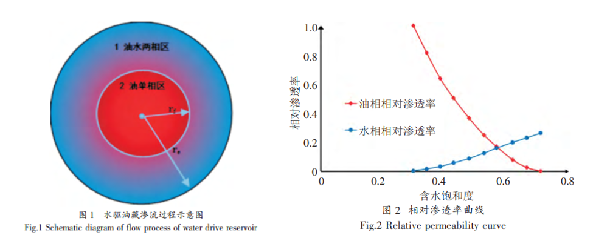

A large number of practical production show that there's threshold pressure gradient in low permeability reservoirs,before water breakthrough and water drive front of pure oil region for single-phase flow,other area for oil-water two phase flow,so different seepage area should be considered respectively different threshold pressure gradient.Applying the law of equivalent percolation resistance meanwhile,we divide total filtrational resistance into single phase oil flow area seepage resistance and two-phase flow area flow resistance,and deduced the single well deliverability equation of low permeability reservoir.Verification results show that this calculation method is closer to the actual productivity of single well than that without considering threshold pressure gradient or considering only the results of single-phase threshold pressure gradient and has high precision for further efficient development of low permeability reservoir to provide the theory reference and the basis.

