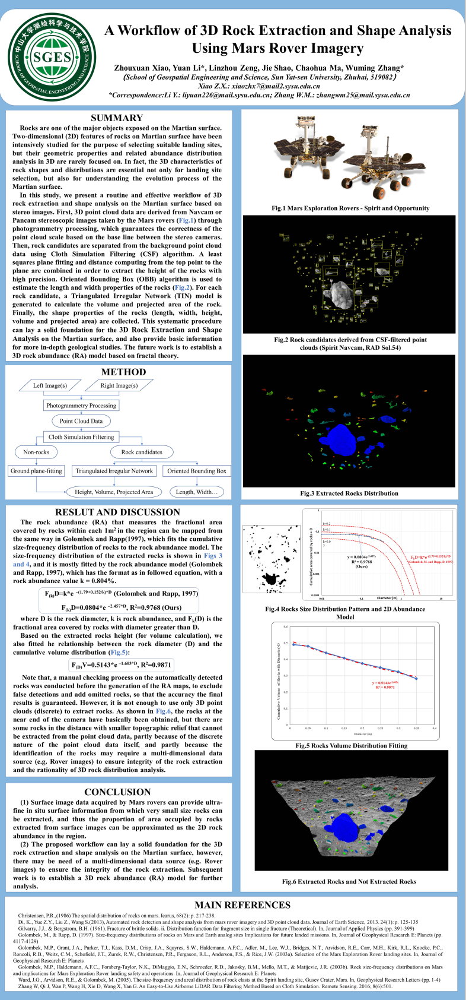

We present a routine and effective workflow of 3D rock extraction and shape analysis on the Martian surface based on stereo images. First, 3D point cloud data are derived from Navcam or Pancam stereoscopic images taken by the Mars rovers through photogrammetry processing, which guarantees the correctness of the point cloud scale based on the base line between the stereo cameras. Then, rock candidates are separated from the background point cloud data using Cloth Simulation Filtering (CSF) algorithm. A least squares plane fitting and distance computing from the top point to the plane are combined in order to extract the height of the rocks with high precision. Oriented Bounding Box (OBB) algorithm is used to estimate the length and width properties of the rocks. For each rock candidate, a Triangulated Irregular Network (TIN) model is generated to calculate the volume and projected area of the rock. Finally, the shape properties of the rocks (length, width, height, volume and projected area) are collected. This systematic procedure can lay a solid foundation for the 3D Rock Extraction and Shape Analysis on the Martian surface, and also provide basic information for more in-depth geological studies.

